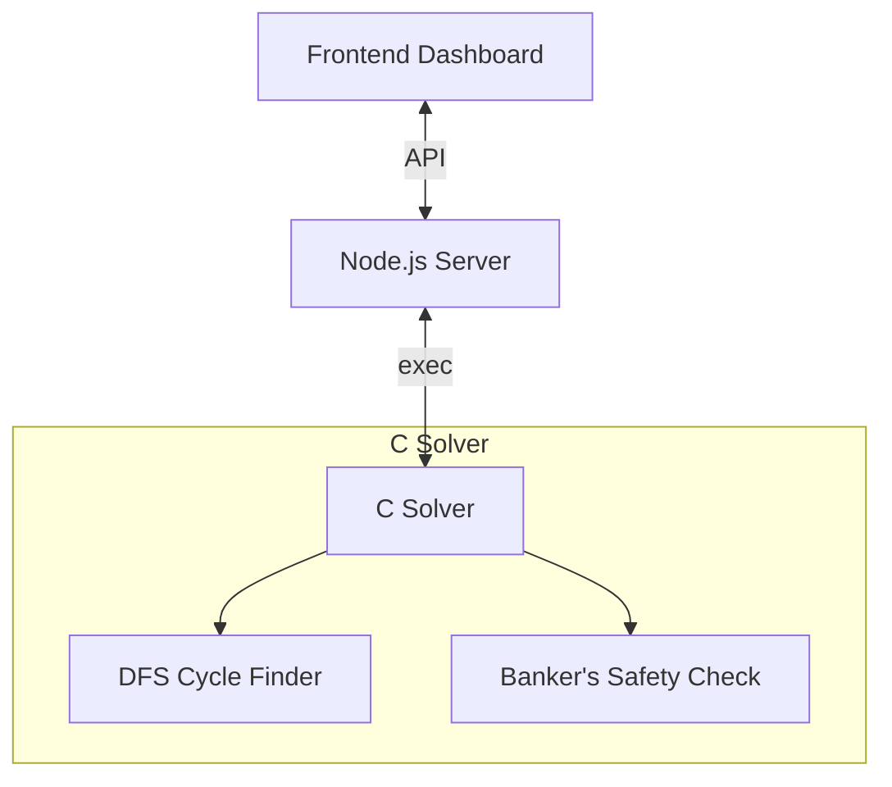

# Deadlock Analyzer & Visualizer

A simulator and visualizer for classic operating system deadlocks. The simulation engine is written in C, producing JSON trace logs, and is coupled with a Node.js server to serve an interactive glassmophic frontend.



## Features

- **DFS Cycle Detection**: Identifies circular wait patterns on Resource Allocation Graphs (RAG).
- **Dining Philosophers**: Simulates classic resource allocation deadlock step-by-step.
- **Banker's Algorithm**: Demonstrates safety matrix analyses (Allocation, Max, and Need vectors).
- **Control Interface**: Step forward/backward, adjust speed, or auto-play.

---

## Technical Details

### RAG Cycle Detection
Processes and resources form a directed bipartite graph. When resources have single units, deadlocks are equivalent to cycles in this graph. The C engine performs a Depth First Search (DFS):
- **Unvisited**: Node has not been touched.
- **Visiting**: Node is on the recursion stack. Reaching a visiting node signifies a cycle (back edge).
- **Visited**: Node has been fully evaluated.

### Banker's Safety
Handles multi-instance resources. It verifies if an allocation request remains safe by executing a scheduling loop looking for a valid sequence that lets processes run to completion using available resources:

$$\text{Need}[i][j] = \text{Max}[i][j] - \text{Allocation}[i][j]$$

$$\text{Work} = \text{Work} + \text{Allocation}[i]$$

---

## Running the Application

### Prerequisites
- GCC Compiler
- Node.js

### Instructions
1. Allow execution of the startup script:
   ```bash
   chmod +x run.sh
   ```
2. Build and launch the environment:
   ```bash
   ./run.sh
   ```
3. Open `http://localhost:3000` in your web browser.
